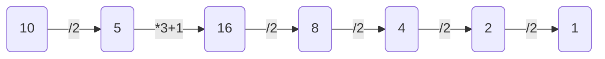

# DST NSI N°1

### 10/11/2022
___

### Le sujet est à traiter en 2h  
  
### Toute trace de recherche sera prise en compte.  
  
### Le candidat devra rendre un fichier python (.py) à la fin du temps prévu. Il pourra l'envoyer par mail à [tristan.larguier@gmail.com](mailto:tristan.larguier@gmail.com) ou l'envoyer en message privé sur Discord à [lieutenant X#5939](https://discord.com/).  
#### Si des recherches ont été menées sur papier le candidat peut rendre sa copie, qui sera prise en compte dans la notation
___
## Exercice 1 : BAC 2021 Amérique du Nord 1

*cet exercice porte sur les tableaux et sur la programmation de base en Python*

On rappelle que len est une fonction qui prend un tableau en paramètre et renvoie sa longueur.  
C’est-à-dire le nombre d’éléments présents dans le tableau.  
**Exemple :** len([12, 54, 34, 57]) vaut 4.

Le but de cet exercice est de programmer différentes réductions pour un site de vente de vêtements en ligne.

On rappelle que si le prix d’un article avant réduction est de x euros :
- son prix vaut 0,5x si on lui applique une réduction de 50%,
- son prix vaut 0,6x si on lui applique une réduction de 40%,
- son prix vaut 0,7x si on lui applique une réduction de 30%,
- son prix vaut 0,8x si on lui applique une réduction de 20%,
- son prix vaut 0,9x si on lui applique une réduction de 10%.

Dans le système informatique du site de vente, l’ensemble des articles qu’un client veut acheter, appelé panier, est modélisé par un tableau de flottants.  
Par exemple, si un client veut acheter un pantalon à 30,50 euros, un tee-shirt à 15 euros, une paire de chaussettes à 6 euros, une jupe à 20 euros, une paire de collants à 5 euros, une robe à 35 euros et un short à 10,50 euros, le système informatique aura le tableau suivant : 
```python
tab = [30.5, 15.0, 6.0, 20.0, 5.0, 35.0, 10.5]
```

1. **(a)** Écrire une fonction Python **total_hors_reduction** ayant pour argument le tableau des prix des articles du panier d'un client et renvoyant le total des prix de ces articles.  
	**(b)** Le site de vente propose la promotion suivante comme offre de bienvenue : 20% de réduction sur le premier article de la liste, 30% de réduction sur le deuxième article de la liste (s’il y a au moins deux articles) et aucune réduction sur le reste des articles (s’il y en a).  
	Recopier sur la copie et compléter la fonction Python **offre_bienvenue** prenant en paramètre le tableau **tab** des prix des articles du panier d’un client et renvoyant le total à payer lorsqu’on leur applique l’offre de bienvenue.
```python
def offre_bienvenue(tab):
	""" tableau -> float """
	somme = 0
	longueur = len(tab)
	if longueur > 0:
		somme = tab[o] * ...
	if longueur > 1:
		somme = somme + ...
	if longueur > 2:
		for i in range(2, longueur):
			somme = ...
	return ...
```

*Pour toute la suite de l’exercice, on pourra utiliser la fonction total_hors_reduction même si la question 1 n’a pas été traitée.*

2. Lors de la période des soldes, le site de vente propose les réductions suivantes :
	- si le panier contient 5 articles ou plus, une réduction globale de 50%,
	- si le panier contient 4 articles ou plus, une réduction globale de 40%,
	- si le panier contient 3 articles ou plus, une réduction globale de 30%,
	- si le panier contient 2 articles ou plus, une réduction globale de 20%,
	- si le panier contient 1 articles ou plus, une réduction globale de 10%,

Proposer une fonction Python **prix_solde** ayant pour argument le tableau **tab** des prix des articles du panier d’un client et renvoyant le total des prix de ces articles lorsqu’on leur applique la réduction des soldes.

3. **(a)** Écrire une fonction **minimum** qui prend en paramètre un tableau **tab** de nombres et renvoie la valeur minimum présente dans le tableau  
	**(b)** Pour ses bons clients, le site de vente propose une offre promotionnelle, à partir de 2 articles achetés, l’article le moins cher des articles commandés est offert.  
	Écrire une fonction Python **offre_bon_client** ayant pour paramètre le tableau des prix des articles du panier d’un client et renvoyant le total à payer lorsqu’on leur applique l’offre bon client

4. Afin de diminuer le stock de ses articles dans ses entrepôts, l’entreprise imagine faire l’offre suivante à ses clients : en suivant l’ordre des articles dans le panier du client, elle considère les 3 premiers articles et offre le moins cher, puis les 3 suivants et offre le moins cher et ainsi de suite jusqu’à ce qu’il reste au plus 2 articles qui n’ont alors droit à aucune réduction.  
	**Exemple** : Si le panier du client contient un pantalon à 30,50 euros, un tee-shirt à 15 euros, une paire de chaussettes à 6 euros, une jupe à 20 euros, une paire de collants à 5 euros, une robe à 35 euros et un short à 10,50 euros, ce panier est représenté par le tableau suivant :
```python
tab = [30.5, 15.0, 6.0, 20.0, 5.0, 35.0, 10.5]
```
Pour le premier groupe (le pantalon à 30,50 euros, le tee-shirt à 15 euros, la paire de chaussettes à 6 euros), l’article le moins cher, la paire de chaussettes à 6 euros, est offert. Pour le second groupe (la jupe à 20 euros, la paire de collants à 5 euros, la robe à 35 euros), la paire de collants à 5 euros est offerte.  
Donc le total après promotion de déstockage est 111 euros.  
On constate que le prix après promotion de déstockage dépend de l’ordre dans lequel se présentent les articles dans le panier.  
	**(a)** Proposer un panier contenant les mêmes articles que ceux de l’exemple mais ayant un prix après promotion de déstockage différent de 111 euros.  
	**(b)** Proposer un panier contenant les mêmes articles mais ayant le prix après promotion de déstockage le plus bas possible.  
	**(c)** Une fois ses articles choisis, quel algorithme le client peut-il utiliser pour modifier son panier afin de s’assurer qu’il obtiendra le prix après promotion de déstockage le plus bas possible ?  
	*On ne demande pas d’écrire cet algorithme.*


## Exercice 2 : Conjecture de Syracuse

*Cet exercice porte sur les fonctions récursives et l'exploitation d'entiers en Python*

### Énoncé de la conjecture de Syracuse

Prendre un nombre entier:  
- Si ce nombre est pair, le diviser par 2.  
- Si ce nombre est impair, prendre le triple et ajouter 1.  
  
On obtient un nouveau nombre entier et on recommence :  
- Si ce nombre est pair, le diviser par 2.  
- Si ce nombre est impair, prendre le triple et ajouter 1.  
  
Et on recommence ainsi de suite avec les entiers successifs obtenus...  
La conjecture de Syracuse dit qu’à la fin, on obtient toujours 1.   

### Mathématiquement :
- $U_0 = N$
- $U_{n+1} = \left\{ \begin{matrix} U_n/2 & \text{si }U_n\text{ paire} \\ U_n \times 3 + 1 & \text{si }U_n\text{ impaire} \end{matrix}\right.$

Exemple :  
  
On choisis le nombre entier 10.  
10 est pair, on prend la moitié, on trouve 5.  
5 est impair, on prend le triple et on ajoute 1, on trouve 16.  
16 est pair, on prend la moitié, on trouve 8.  
8 est pair, on prend la moitié, on trouve 4.  
4 est pair, on prend la moitié, on trouve 2.  
2 est pair, on prend fa moitié, on trouve 1.


___
1. Écrire la fonction **syracuse** prenant en argument un nombre entier **N** strictement positif et renvoyant la liste des termes de la suite.
2. Écrire la fonction récursive **syracuse_recursif** prenant en argumant un nombre entier N strictement positif et renvoyant la liste des termes de la suite.

Voici une représentation graphique de **suracuse(14)** :  
  
On remarque que les termes de la suites peuvent avoir une trajectoire chaotique, comme une feuille emportée par le vent. On parle donc de **vol**.

- Le **temps de vol** est le plus petit indice **n** tel que $U_n = 1$ (il est ici de 17).
- Le **temps de vol en altitude** est le plus petit indice **n** tel que $U_{n+1} < U_0$ (il est ici de 0).
- L'**altitude maximale** est la valeur maximale de la suite (elle est ici de 52).

Quelles que soient les réponses aux questions précédentes on utilisera le code suivant :
```python
def syracuse(n):
    if n == 1:
        return True
    if n%2 == 0:
        return syracuse(n//2)
    return syracuse(n*3+1)

print(syracuse(14))
```

3. Modifier le code précédent pour retourner le temps de vol.
4. Modifier le code précédent pour retourner l'altitude maximale.
5. Modifier le code précédent pour retourner le temps de vol en altitude.
