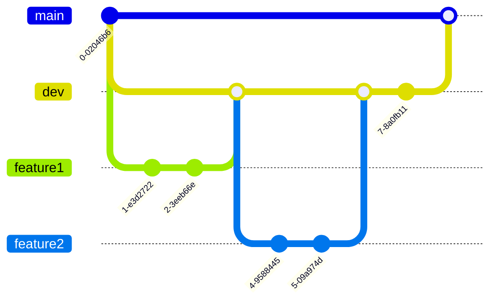

# Utilisation de Github

## introduction

Github est un outil de gestion de version de code. Il permet de travailler en équipe sur un projet, de suivre les modifications apportées au code, de revenir en arrière si besoin, de gérer les conflits, de partager son code avec la communauté, de travailler sur plusieurs branches, etc.  
Il est très utilisé dans le monde du développement informatique, et il est important de savoir l'utiliser pour travailler en équipe. D'autres outils similaires existent, comme Gitlab ou Bitbucket, mais Github est le plus populaire et ils sont tous issues de la même technologie : Git.

Pour utiliser Github, il faut d'abord créer un compte sur le site [github.com](https://github.com). Le fonctionnement de Github est basé sur des dépôts (repositories) qui contiennent les fichiers du projet. Chaque dépôt a une URL qui permet d'y accéder, et on peut cloner un dépôt sur son ordinateur pour travailler dessus. Si ça paraît compliqué, pas de panique, c'est le même principe que pour un dossier partagé sur Google Drive ou Dropbox.

## Créer un dépôt

Pour créer un dépôt, il suffit de cliquer sur le bouton "New" en haut à droite de la page d'accueil de Github. On peut choisir le nom du dépôt, s'il est public ou privé, s'il contient un fichier README, etc.  
Une fois le dépôt créé, on peut y ajouter des fichiers, les modifier, les supprimer, etc. On peut aussi ajouter des collaborateurs au dépôt pour travailler en équipe.

## Cloner un dépôt

Lorsqu'un répo existe déjà, on peut le cloner sur son ordinateur pour travailler dessus. Pour cela, il faut copier l'URL du dépôt et utiliser la commande `git clone <lien>` dans un terminal.  
Cela va copier tous les fichiers sur l'ordinateur local. On peut ensuite travailler sur les fichiers, les modifier, les supprimer, etc... exactement comme si on travaillait sur un dossier normal.  
Une fois les modifications apportées on va exécuter les trois commandes suivantes pour envoyer les modifications sur le dépôt distant :

```bash
git add .
git commit -m "message"
git push
```
git add . permet d'ajouter les fichiers modifiés au dépôt local.  
git commit -m "message" permet de valider les modifications avec un message.  
git push permet d'envoyer les modifications sur le dépôt distant.

## Travailler en équipe

Le plus dure dans un projet en équipe est de gérer les versions de fichiers. Si deux personnes modifient le même fichier en même temps, il y a un risque de conflit, on ne sait pas quelle version garder et le travail risque d'être fait deux fois. Pour éviter cela on utilise des branches.

Une branche est une version parallèle du projet. On peut créer une branche pour travailler sur une fonctionnalité, une correction de bug, etc. Une fois le travail terminé, on fusionne la branche avec la branche principale (master).

Pour créer une branche on utilise la commande `git checkout -b <nom>`.  
Pour changer de branche on utilise la commande `git checkout <nom>`.  
Pour fusionner une branche dans une autre on fait une pull request sur Github. Ce système permet de vérifier les modifications avant de les fusionner.



Voici un exemple de workflow avec deux branches feature1 et feature2 qui sont fusionnées dans la branche dev, puis la branche dev est fusionnée dans la branche main.  
La branche main est la branche principale du projet, c'est celle qui est déployée en production, donc elle doit toujours être fonctionnelle.  
La branche dev est la branche de développement, c'est celle sur laquelle on travaille, on peut y ajouter des fonctionnalités, des corrections de bugs, etc... On peut la configurer pour qu'elle soit automatiquement déployée sur un serveur de test. Une fois que les features sont validées et stables sur dev on les fusionne dans main.

## Travail sur une branche

Sauf exception le créateur d'une branche est le seul à travailler dessus. Si plusieurs personnes travaillent sur la même branche il y a un risque de conflit. Une branche ne doit servir qu'à une unique feature, une fois la feature terminée on la fusionne dans la branche principale.

## convention de nommage

Pour faciliter la gestion des branches il est conseillé de suivre une convention de nommage. Par exemple, on peut nommer les branches de la manière suivante :
- feature/nom : pour une nouvelle fonctionnalité
- bugfix/nom : pour une correction de bug
- hotfix/nom : pour une correction de bug critique
- chore/nom : pour une tâche de maintenance

Les commits doivent aussi être clairs et précis. Il est conseillé de les nommer de la manière suivante, en ajoutant une courte description de la modification :
- feat: ajout d'une nouvelle fonctionnalité
- fix: correction d'un bug
- docs: modification de la documentation
- style: modification de l'aspect visuel
- refactor: refactoring du code

## Conclusion

Github est un outil très puissant pour travailler en équipe sur un projet. Il permet de gérer les versions de fichiers, de travailler sur plusieurs branches, de partager son code avec la communauté, etc. Il est important de savoir l'utiliser pour travailler en équipe, et il est conseillé de suivre une convention pour que tout le monde s'y retrouve.
